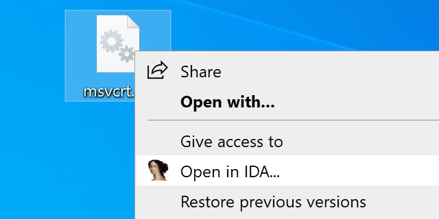

# [IDA 8.2](https://hex-rays.com/blog/ida-8-2-released/) added 32 bit support to IDA64, making this plugin largely unnecessary.

---

# IDAShell

    

## About

IDAShell is a shell extension for launching IDA from the context menu of executables.

## Usage

Just install and it works. If you moved IDA / want to point the shell extension to another copy, hold Shift while clicking "Open in IDA..." and you will be prompted for IDA's location again

## Features

* Automatically select which one of ida.exe / ida64.exe is needed
* PE, ELF, Mach-O support

## Download

[Latest release](https://github.com/namazso/IDAShell/releases/latest)

## Donations

This software is provided completely free of charge to you, however I spent time and effort developing it. If you like this software, please consider making a donation:

* Bitcoin: 1N6UzYgzn3sLV33hB2iS3FvYLzD1G4CuS2
* Monero: 83sJ6GoeKf1U47vD9Tk6y2MEKJKxPJkECG3Ms7yzVGeiBYg2uYhBAUAZKNDH8VnAPGhwhZeqBnofDPgw9PiVtTgk95k53Rd

## Building

1. Build Solution for all Release targets
2. Compile installer.iss with InnoSetup

## License

	Copyright 2021 namazso <admin@namazso.eu>
	IDAShell - Shell extension for opening executables in IDA
	
	IDAShell is free software: you can redistribute it and/or modify
	it under the terms of the GNU General Public License as published by
	the Free Software Foundation, either version 3 of the License, or
	(at your option) any later version.
	
	IDAShell is distributed in the hope that it will be useful,
	but WITHOUT ANY WARRANTY; without even the implied warranty of
	MERCHANTABILITY or FITNESS FOR A PARTICULAR PURPOSE.  See the
	GNU General Public License for more details.
	
	You should have received a copy of the GNU General Public License
	along with IDAShell.  If not, see <https://www.gnu.org/licenses/>.
